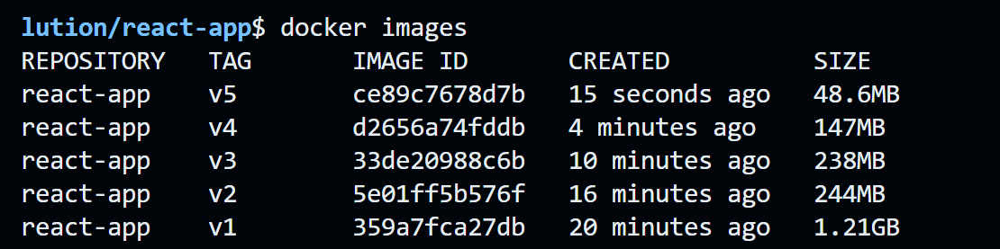

# 🐳 Dockerfile Optimization

This project demonstrates an evolving series of Dockerfiles designed to apply **Docker best practices**, especially focused on:
- Reducing image size
- Improving build efficiency
- Using multi-stage builds
- Separating concerns (build vs runtime)
- Optimizing for production


## Dockerfile Versions

| Version     | Improvements Introduced                         |
|-------------|--------------------------------------------------|
| v1          | Basic Node-based build                          |
| v2          | Using light weight alpine image|
| v3          |  Multi-stage build |
| v4          | Production build with static output only        |
| v5          | Alpine base image for minimal size               |

Each Dockerfile is named like: `dockerfile.v1`, `dockerfile.v2`, ..., `dockerfile.v5`.

## 📦 Docker Image Size Comparison


## 🚀 Running the Builds

Navigate into the project directory and run a specific version using:

```bash
cd react-app
````

e.g
```bash
docker build -f Dockerfiles/dockerfile.v5 -t react-demo:v5 .
````

---

